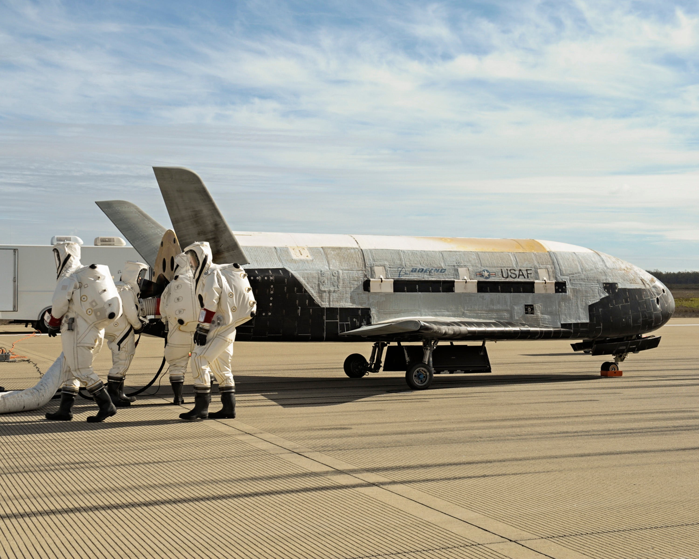

### [Hikaru Nakamura by Andreas Kontokanis](https://commons.wikimedia.org/wiki/File:Nakamura_Hikaru_(29290269410).jpg)



I really like how the focus on this image really highlights Nakamura

### [John M. Innes in 1948](https://gencat.eloquent-systems.com/city-of-toronto-archives-m-permalink.html?key=142076)



I love the composition of this photograph

### [Puffins and Pufted Puffin License Plate](https://www.oregonlive.com/trending/2024/07/a-new-tufted-puffin-license-plate-is-coming-thanks-to-the-oregon-coast-aquarium.html)

{% include image.html 
    src="assets/photos-I-like/puffins-and-pufted-puffin-license-plate.jpeg" 
    alt="Tufted puffin license plate with some tufted puffins." 
    caption="Tufted puffin license plate pictured with some tufted puffins. ([Jeremy Burke](https://www.linkedin.com/in/jeremy-burke-4367411/) by [Oregon Coast Aquarium](https://ktvl.com/news/local/gallery/new-oregon-coast-aquarium-license-plate-to-support-wildlife-rehabilitation-efforts?photo=5))"
    source="https://www.oregonlive.com/trending/2024/07/a-new-tufted-puffin-license-plate-is-coming-thanks-to-the-oregon-coast-aquarium.html via [Tyler Cowen](https://marginalrevolution.com/marginalrevolution/2024/07/friday-assorted-links-477.html?utm_source=rss&utm_medium=rss&utm_campaign=friday-assorted-links-477#:~:text=management%20so%20male%3F-,6.%20mie%3A%20oregon%20puffin%20license%20plates.,-7.%20For%20the)"
%}

The photo is well framed with the license plate and puffins.

### [Cyber Punk Military via Kane](https://x.com/kane/status/1813416563783225684)

  

    
  

  

    
  

  

    
  

  

    
  

  

    
  

## Threads of Photos I Like
- [Most Beautiful Metro Stations on Earth](https://x.com/JamesLucasIT/status/1808915462731747614) by [James Lucas (@JamesLucasIT)](https://x.com/JamesLucasIT)
- [World’s best new architecture revealed-CNN](https://www.cnn.com/2024/07/10/style/waf-awards-2024-best-new-architecture/index.html) via [Marginal Revolution](https://marginalrevolution.com/marginalrevolution/2024/07/friday-assorted-links-477.html?utm_source=rss&utm_medium=rss&utm_campaign=friday-assorted-links-477#:~:text=4.%20new%20architectural%20citations.)
